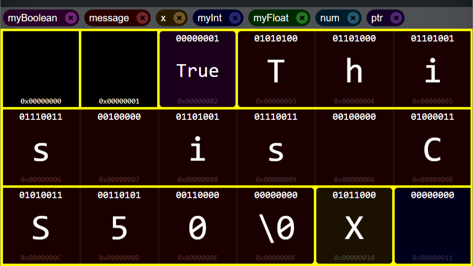

# Memory Simulator

## Live Demo
https://nima-ghomri.github.io/memory-simulator/

## Video Demo:  https://youtu.be/3nQLm7AwTVA

## Description:
This project is a simple memory simulator which demonstrates how bytes are allocated and variables are stored in memory.

### Inspiration
In [week 4 lecture (Memory)](https://cs50.harvard.edu/x/2022/weeks/4/) of [CS50 Introduction to Computer Science](https://cs50.harvard.edu/x/2022/) course, the instructor David Malan explained how data types like integers or strings store in computer memory. The slides were easy to understand and pictorially nice to look at. So, I decided to create a project to implement something like the slides but with the capability to create and modify variables dynamically. That was how the idea of the memory simulator obtained.

### Functionality
The entry point to the application is `simulator.js` file. The memory itself implemented as a JavaScript class `Memory.js` which has the responsibility of allocating the memory given the number of desirable bytes. There are two kinds of objects in Memory class, the Variable and the Byte, located in `Variable.js` and `Byte.js` respectively. There are multiple data types available to choose from:

* bool
* int
* long
* float
* double
* string
* char
* pointer

First an html form get the data type, the name of the variable and the value of it, which are specified by user. Then they instantiate a Variable object and it will be stored on a custom location in memory selected by user.

### Binary Conversion
The memory architecture selected for this project is Big-Endian ([Endianness](https://en.wikipedia.org/wiki/Endianness)). This means that the most significant byte (the first byte of data is stored in the the smallest address number of the bytes range selected for storing the variable.

For integer and long data types both One’s complement and Two’s Complement algorithms are being used explained in this [article](https://www.log2base2.com/storage/how-integers-are-stored-in-memory.html) (look at `getIntegerBytes` function in Memory.js file).

For float and double numbers, the process explained in this [link](https://www.log2base2.com/storage/how-float-values-are-stored-in-memory.html) is translated into JavaScript code (look at `getFloatBytes` function in Memory.js file).

For pointer variables, a list of existing variables in memory (including currently defined pointers) is available for user to select. 

### Visuals
I used bootstrap to create the theme for the web pages and forms, buttons etc. but the main challenge was the creation of the memory itself. I implemented many CSS classes to get the desirable look for bytes (which is similar to David's slides in the lecture). inside of each Byte is the bits of data that are stored, address of it and the representing variable values which should be align correctly. All these implementations are located in `simulator.css` file.

I used `var()` function add CSS variables to create consistent colors for each data type. Each type has its own CSS class which inside them I change the value of `–data-color` variable. Using CSS `hsl()` function I can shift colors slightly for different parts of `simulator.html` page i.e. variables, bytes and data types select options field for each type.
Creating a variable will cause bytes to merge (the borders get similar color as the data type and the corners of first and last byte get rounded) causing to create a unit which is visually separated from the rest of the memory.
